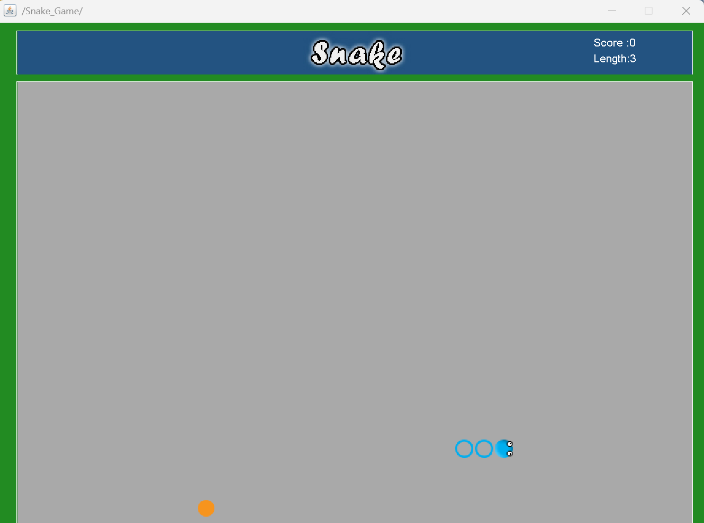

# 🐍 Snake-Game


## 📌 Project Overview
This project is a **classic Snake Game** developed using **Java (Swing and AWT)**. The game features a snake that grows in length after consuming food, with increasing difficulty as the game progresses. The objective is to achieve the highest score without colliding with the walls or the snake's own body. The game ends if the snake touches its own tail, and the player can **restart the game by pressing the spacebar**.

## ✨ Features
✅ **Smooth Gameplay** – Seamless movement and intuitive controls  
✅ **Scoring System** – Increases as the snake consumes food  
✅ **Game Over Message** – Displays score and restart instruction when the game ends  
✅ **Restart with Spacebar** – Allows restarting the game after Game Over  
✅ **Responsive Key Controls** – Easy to navigate with arrow keys

## 🔧 Tech Stack
- **Backend:** Java (Swing & AWT)
- **IDE Used:** IntelliJ IDEA / Eclipse / VSCode

## 🚀 Upcoming Features
🔹 **Multiple Difficulty Levels**  
🔹 **Pause/Resume Feature**  
🔹 **Sound Effects for Game Events**  
🔹 **Customizable Themes & Snake Skins**

## 📽️ Project Demo
### 🎥 Watch on YouTube
[](https://youtu.be/WEcKTovrMUU)  

## 📂 Installation & Usage
1. Clone this repository:
   ```bash
   git clone https://github.com/M-Meeran-Siddiqui/Snake_Game.git
   ```
2. Open the project in your preferred IDE.

3. Compile and run `Main.java` to start the game.
